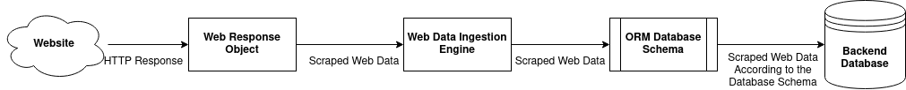

Introduction
=============
The Velkoz Web Scraping Library is a python library for performing Extraction Transformation and Loading of data from websites. The Velkoz library was fundamentally designed to create and maintain databases that serve as the backend for various data dashboards and statistical models. For example, this library began as a series of objects and methods that allowed stock price data extracted from Yahoo Finance to be written to a database at the end of every trading day airflow scheduling.

Conceptually, the library is built off of three main objects:

* The Web Response Object
* The Data Ingestion Engine
* The ORM Database Mode

Extracting data from the web and writing it to a database via the Velkoz library is accomplished via the following steps:

An HTTP request is sent to a website via the Web Response Object where the HTTP response content is stored. The Web Response Object is intended to represent all of the data and associated metadata from a single url. Web Response Objects are then passed into the Data Ingestion Engine Object. The Ingestion Engine reads data from Web Response Objects and writes said data to the Ingestion Engine’s associated database according to the database schema described by an associated ORM (SQLAlchemy Database Model).

When writing new or using existing pipeline objects the velkoz framework requires these three objects: A Response Object, an Ingestion Engine and a database schema associated with the Ingestion Engine

.. toctree::
   :maxdepth: 2
   :caption: Velkoz Framework Elements:

   high_level_framework_docs/web_response_object
   high_level_framework_docs/data_ingestion_engine
   high_level_framework_docs/ingestion_db_schema
