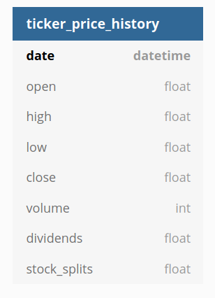
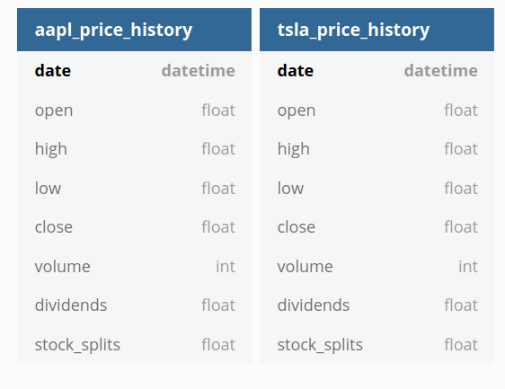
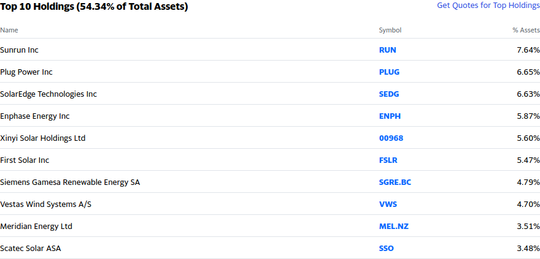
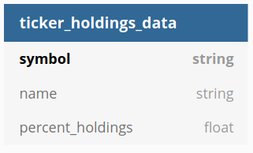
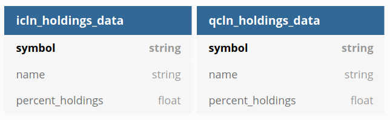

Velkoz Stock Data Packages
===========================
These Packages scrape and ingest mainly quantitative data related to publicly traded
stocks on various exchanges. These objects are the backbone upon which all Quantitative
financial analysis on the Velkoz platform is based.

Stock Price WebPageResponse Objects
************************************
The most basic stock data web objects are the web objects that extract price data.
In keeping with the standard, prices for stocks listed on each exchange are represented
by a WebPageResponse Object. All of the exchange specific WebPageResponse Objects are ingested
into the database via the StockPriceDataIngestionEngine. The NASDAQStockPriceResponseObject is
used as an example for the remainder of the documentation (needless to say it is designed for stocks
listed on the NASDAQ).

Critically StockPriceResponseObjects **do not inherit from the BaseWebPageResponse Object.**
This is one of the few exceptions to the rule of WebPageResponse objects inheriting from a
lower-level object. This is due to the excessive simplicity of the StockPriceResponseObjects
as they perform an extremely simplistic function in which the logic for ticker specific price
extraction is largely outsourced to 3rd party libraries (yfinance in the case of the
NASDAQStockPriceResponseObject). The StockPriceResponseObjects contain basic metadata such
as **initialized time** and, most importantly, the entire time series price data for the
stock in question is stored in the **_price_history_full** parameter.

.. autoclass:: velkoz_web_packages.objects_stock_data.objects_stock_price.web_objects_stock_price.NASDAQStockPriceResponseObject
   :show-inheritance:
   :members:
   :private-members:
   :undoc-members:

Stock Price Data Ingestion Engine
**********************************
The Ingestion Engine for StockPriceResponseObjects is the StockPriceDataIngestionEngine.
It, unlike the StockPriceResponse Objects it was designed for, does inherit directly from
the BaseWebPageIngestionEngine and overwrite the key database writing method **_add_session_web_obj**
to suit the StockPriceResponseObjects format. The internal validation of the Ingestion Engine is
also overwritten to validate only StockPriceResponseObjects and the StockPriceDataIngestionEngine
supports all StockPriceResponseObjects.

The Ingestion Engine writes price time series data (in a brute force and in-efficient
way via the pd.to_sql(if_exists=“replace”) method but that is neither here nor there) to
a database with the following database schema:

Example of the StockPriceDataIngestionEngine populating a database:

.. code-block:: python

  # Example of various StockPriceRespose Objects to be written to the database:
  aapl = NASDAQStockPriceResponseObject('AAPL')
  tsla = NASDAQStockPriceResponseObject('TSLA')

  # Creating Ingestion Engine:
  Stock_Price_Ingestion_Engine = StockPriceDataIngestionEngine("db_URI")

  # Adding the StockPriceRespose Objects to the engine que:
  Stock_Price_Ingestion_Engine._insert_web_obj(aapl)
  Stock_Price_Ingestion_Engine._insert_web_obj(tsla)

  # Writing all StockPriceRespose Objects to the database and emptying the que:
  Stock_Price_Ingestion_Engine._write_web_objects()

This operation would produce two new tables in a database:

.. autoclass:: velkoz_web_packages.objects_stock_data.objects_stock_price.ingestion_engines_stock_price.StockPriceDataIngestionEngine
   :show-inheritance:
   :members:
   :private-members:
   :undoc-members:

Fund Holdings WebPageResponse Objects
**************************************
The NASDAQFundHoldingsResponseObject is the stock data web object that extracts
the holdings data for a fund listed on Yahoo Finance.com based on an input ticker
symbol. It inherits from the BaseWebPageResponse base object and uses the primary
framework for extracting and parsing web data:

HTTP Request via requests library --> Parsing HTML content via Beautiful
Soup library  --> Converting Extracted Data to Structured Data in form
of Pandas Dataframe.

When a fund ticker is used to initialize this WebPageResponse Object it scrapes and
extracts the following data from Yahoo Finance:

.. autoclass:: velkoz_web_packages.objects_stock_data.objects_fund_holdings.web_objects_fund_holdings.NASDAQFundHoldingsResponseObject
   :show-inheritance:
   :members:
   :private-members:
   :undoc-members:

Fund Holdings Data Ingestion Engine
************************************
The Ingestion Engine for the NASDAQFundHoldingsResponseObject is the FundHoldingsDataIngestionEngine.
It directly inherits from the BaseWebPageIngestionEngine and overwrites the key
database writing method _add_session_web_obj to suit the NASDAQFundHoldingsResponseObject
format. The internal validation of the Ingestion Engine is also overwritten to validate
only NASDAQFundHoldingsResponseObject and the BaseWebPageIngestionEngine supports all
NASDAQFundHoldingsResponseObject.

The Ingestion Engine writes price time series data (in a brute force and in-efficient
way via the pd.to_sql(if_exists=“replace”) method but that is neither here nor there)
to a database with the following database schema:

Example of the FundHoldingsDataIngestionEngine populating a database:

.. code-block:: python

  # Example of various NASDAQFundHoldingsResponse Objects to be written to the database:
  icln = NASDAQFundHoldingsResponseObject('ICLN')
  qcln = NASDAQFundHoldingsResponseObject('QCLN')

  # Creating the Ingestion Engine:
  fund_holding_ingestion_engine = FundHoldingsDataIngestionEngine("db_URI")

  # Adding the two NASDAQStockPriceResponseObjects to the Ingestion Engine Que:
  fund_holding_ingestion_engine._insert_web_obj(icln)
  fund_holding_ingestion_engine._insert_web_obj(qcln)

  # Writing all objects within the que to the database:
  fund_holding_ingestion_engine._write_web_objects()

This operation would produce two new tables in the database:

.. autoclass:: velkoz_web_packages.objects_stock_data.objects_fund_holdings.ingestion_engines_fund_holdings.FundHoldingsDataIngestionEngine
   :show-inheritance:
   :members:
   :private-members:
   :undoc-members:
